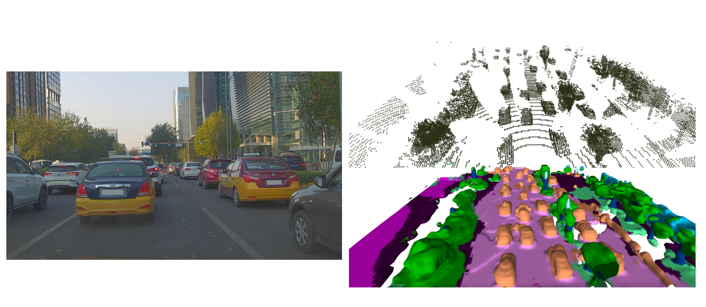
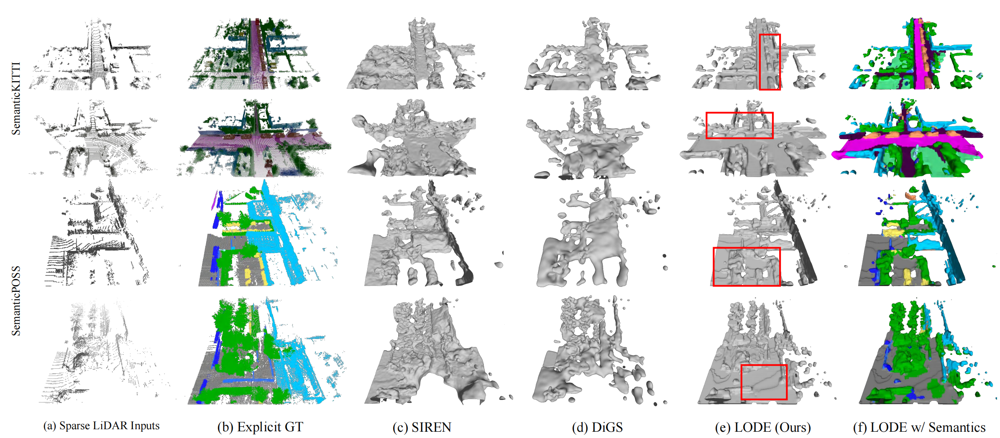

# LODE: Locally Conditioned Eikonal Implicit Scene Completion from Sparse LiDAR

This repository is an official implementation of [**LODE**]():

LODE: Locally Conditioned Eikonal Implicit Scene Completion from Sparse LiDAR

[Pengfei Li](https://scholar.google.com/citations?hl=en&user=hmii_L8AAAAJ), Ruowen Zhao, [Yongliang Shi](https://github.com/liangyongshi), [Hao Zhao](https://sites.google.com/view/fromandto), [Guyue Zhou](https://air.tsinghua.edu.cn/en/info/1046/1196.htm), [Ya-Qin Zhang](https://air.tsinghua.edu.cn/en/info/1046/1188.htm)
 from <a href="http://air.tsinghua.edu.cn/EN/" target="_blank">Institute for AI Industry Research(AIR), Tsinghua University</a>.

For complete video, click [HERE](https://youtu.be/8x_XOSrr5K0).

We use the proposed model trained on the KITTI dataset to predict implicit completion results on the novel [DAIR-V2X](http://air.tsinghua.edu.cn/dair-v2x/) dataset. The results are impressive:

## Introduction

Scene completion refers to obtaining dense scene representation from an incomplete perception of complex 3D scenes. 
This helps robots understand the environment in scenarios such as autonomous driving, as well as giving human-friendly representations to improve human understanding of the visual information captured by robots.
Recent advances show that implicit representation learning can be leveraged for continuous scene completion and achieved through physical constraints like Eikonal equations.
However, former Eikonal completion methods only demonstrate results on watertight meshes at a scale of tens of meshes.
None of them are successfully done for non-watertight LiDAR point clouds of open large scenes at a scale of thousands of scenes.
In this paper, we propose a novel Eikonal formulation that conditions the implicit representation on localized shape priors which function as dense boundary value constraints, and demonstrate it works on SemanticKITTI and SemanticPOSS.
It can also be extended to semantic Eikonal scene completion with only small modifications to the network architecture.
With extensive quantitative and qualitative results, we demonstrate the benefits and drawbacks of existing Eikonal methods, which naturally leads to the new locally conditioned formulation. Notably, we improve IoU from 31.7\% to 51.2\% on SemanticKITTI and from 40.5\% to 48.7\% on SemanticPOSS.
We extensively ablate our methods and demonstrate that the proposed formulation is robust to a wide spectrum of implementation hyper-parameters.

## Citation

If you find our work useful in your research, please consider citing:

    TODO

## Installation

### Requirements
    
    CUDA=11.1
    python>=3.8
    Pytorch>=1.8
    numpy
    ninja
    MinkowskiEngine
    tensorboard
    pyyaml
    configargparse
    scripy
    open3d
    h5py
    plyfile
    scikit-image

### Data preparation

Download the SemanticKITTI dataset from 
[HERE](http://semantic-kitti.org/assets/data_odometry_voxels.zip).

Download the SemanticPOSS dataset from 
[HERE](http://www.poss.pku.edu.cn/OpenDataResource/SemanticPOSS/SemanticPOSS_dataset.zip).

Unzip them into the same directory as `LODE`.

## Training and inference
The default configuration in our codes is used for the SemanticKITTI dataset.

The configuration for training/inference is stored in `opt.yaml`, which can be modified as needed.

### Locally Conditioned Eikonal Implicit Scene Completion

Run the following command for a certain `task` (train/valid/visualize):

    CUDA_VISIBLE_DEVICES=0 python -m torch.distributed.launch --nproc_per_node=1 main_sc.py --task=[task] --experiment_name=[experiment_name]

### Semantic Extension
#### Semantic Extension A
Run the following command for a certain `task` (ssc_pretrain/ssc_valid/train/valid/visualize):

    CUDA_VISIBLE_DEVICES=0 python -m torch.distributed.launch --nproc_per_node=1 main_ssc_a.py --task=[task] --experiment_name=[experiment_name]

Here, use ssc_pretrain/ssc_valid to train/validate the semantic extension module. Then the pre-trained model can be used to further train the whole model.

#### Semantic Extension B
Run the following command for a certain `task` (train/valid/visualize):

    CUDA_VISIBLE_DEVICES=0 python -m torch.distributed.launch --nproc_per_node=1 main_ssc_b.py --task=[task] --experiment_name=[experiment_name]

For the SemanticPOSS dataset, change `opt.yaml` to `opt_semanticposs.yaml`, change `config_file` in all code files from `semantic-kitti.yaml` to `SemanticPOSS.yaml`, and change `SPLIT_SEQUENCES` in `dataio.py` to `SPLIT_SEQUENCES_SPOSS`.

## Model Zoo
Our pre-trained models can be downloaded here:
<table border="2">
    <tr>
        <td style="background-color:green">
<b>Table</td> 
        <td style="background-color:green">
<b>Ablation</td> 
        <td style="background-color:green" colspan="5">
<b>Checkpoints</td> 
   </tr>
    <tr>
        <td><b>
Table I</td>    
        <td><b>
Dataset</td>    
        <td>
            <a href="https://drive.google.com/file/d/18YPYrKvC7KcMp0nLqU98WnjJs6JTKsda/view?usp=sharing">
                    
SemanticKITTI
            </a>
        </td>  
        <td>
            <a href="https://drive.google.com/file/d/1GtryqqoovjC6oiSQH3kpxvVEHz0yc8m9/view?usp=share_link">
                    
SemanticPOSS
            </a>
        </td>  
        <td>
        </td>  
        <td>
        </td>  
        <td>
        </td>  
    </tr>
    <tr>
        <td><b>
Table II</td>    
        <td><b>
Discriminative Model Structure</td>    
        <td>
            <a href="https://drive.google.com/file/d/1jwHxrRH5xaW95MgaiQ1lYTg8l57E6Taj/view?usp=sharing">
                    
last1 pruning
            </a>
        </td>  
        <td>
            <a href="https://drive.google.com/file/d/1ydzQx4loYYkICJKJi20YG6t05Osb3Djr/view?usp=sharing">
                    
last2 pruning
            </a>
        </td>  
        <td>
            <a href="https://drive.google.com/file/d/1jrugPHXjrv7z5PUQxF_rM-yFGjeHZD_8/view?usp=sharing">
                    
last3 pruning
            </a>
        </td>  
        <td>
            <a href="https://drive.google.com/file/d/1TpkvCEtRGls3ZJklyOiDYwKoUGEH4cCZ/view?usp=sharing">
                    
last4 pruning
            </a>
        </td>
        <td>
            <a href="https://drive.google.com/file/d/1A6_wyJHVZRHudwtaD5w5HebCiv_oL7bY/view?usp=sharing">
                    
4convs output
            </a>
        </td>  
    </tr>
    <tr>
        <td><b>
Table III</td>    
        <td><b>
Generative Model Structure</td>    
        <td>
            <a href="https://drive.google.com/file/d/19vX4i773A6Df6YLTdyP_MxzoR8KCX1Gf/view?usp=sharing">
                    
width128 depth4
            </a>
        </td>  
        <td>
            <a href="https://drive.google.com/file/d/1SED3cV4Fc6Sf2F3bIaf8l5KwgkqI6RMu/view?usp=sharing">
                    
width512 depth4
            </a>
        </td>  
        <td>
            <a href="https://drive.google.com/file/d/1s1WBgNhr_gImO-wDNNGqwcHOziRjTXh5/view?usp=sharing">
                    
width256 depth3
            </a>
        </td>  
        <td>
            <a href="https://drive.google.com/file/d/1-rVag5fkg3l1WzvyjS4zpKZQBowkXj7p/view?usp=sharing">
                    
width256 depth5
            </a>
        </td> 
        <td>
            <a href="https://drive.google.com/file/d/1IW6wUFTej_wBwzSWwFQe5iOT5KXke2Pm/view?usp=sharing">
                    
Gnet relu
            </a>
        </td> 
    </tr>
    <tr>
        <td><b>
Table IV</td>    
        <td><b>
Shape Dimension</td>    
        <td>
            <a href="https://drive.google.com/file/d/1iM2xVFh1Qk27HMKhKp5WyjkSoxsAJqoI/view?usp=sharing">
                    
shape 128
            </a>
        </td>  
        <td>
            <a href="https://drive.google.com/file/d/1QDngtgrYjoMlk4ZKi6bODH8XJnj1aN0N/view?usp=sharing">
                    
shape 512
            </a>
        </td>  
        <td>
        </td>  
        <td>
        </td>  
        <td>
        </td>  
    </tr>
    <tr>
        <td><b>
Table IV</td>    
        <td><b>
Scale Size</td>    
        <td>
            <a href="https://drive.google.com/file/d/1hJb4woXN5uuG7WKOKgwvLzkWxC-Smh5L/view?usp=sharing">
                    
scale 2
            </a>
        </td>  
        <td>
            <a href="https://drive.google.com/file/d/18YPYrKvC7KcMp0nLqU98WnjJs6JTKsda/view?usp=sharing">
                    
 <b> <u> scale 4
            </a>
        </td>  
        <td>
            <a href="https://drive.google.com/file/d/1D8DLWcGFxrFR5_RtrNlV1-Ov7-JPIdTT/view?usp=sharing">
                    
scale 8
            </a>
        </td>  
        <td>
            <a href="https://drive.google.com/file/d/1lAhTYSJQmdAdTWcIpCAHkbOb4UBItMgf/view?usp=sharing">
                    
scale 16
            </a>
        </td>  
        <td>
            <a href="https://drive.google.com/file/d/1tNrCnqmcb8_xgBEL5elis36E3yrSrMLv/view?usp=sharing">
                    
scale 32
            </a>
        </td>  
    </tr>
    <tr>
        <td><b>
Table V</td>    
        <td><b>
Positional Encoding</td>    
        <td>
            <a href="https://drive.google.com/file/d/1MTiB5BgrSMj0tEmz7UykVcUKGgkOJr0J/view?usp=sharing">
                    
no encoding
            </a>
        </td>  
        <td>
            <a href="https://drive.google.com/file/d/12Eoyb1ClU75F_p37wyssVD7INJy2KlHO/view?usp=sharing">
                    
incF level10
            </a>
        </td>  
        <td>
            <a href="https://drive.google.com/file/d/1j46UUuLoRT-8eH6VlyNbJEbU3SRU3oEY/view?usp=sharing">
                    
incT level5
            </a>
        </td>  
        <td>
            <a href="https://drive.google.com/file/d/1RLl_OjhrdSnqtXL88-Q1hXszEtBd-gVD/view?usp=sharing">
                    
incT level15
            </a>
        </td>      
        <td>
        </td>      
    </tr>
    <tr>
        <td><b>
Table VI</td>    
        <td><b>
Sample Strategy</td>    
        <td>
            <a href="https://drive.google.com/file/d/1RQgA_NAuNcBCXDtHTgEatkBme7GfumLG/view?usp=sharing">
                    
nearest
            </a>
        </td>     
        <td>
        </td>  
        <td>
        </td>  
        <td>
        </td>  
        <td>
        </td>  
    </tr>
    <tr>
        <td><b>
Table VII</td>    
        <td><b>
Semantic Extension</td>    
        <td>
            <a href="https://drive.google.com/file/d/17e5M2Z-TFcplfL61b54Zea8lCrBylqyT/view?usp=sharing">
                    
semantic extension A
            </a>
        </td>  
        <td>
            <a href="https://drive.google.com/file/d/1eecCo4_fyuOcfn2zTidSq07xYRrWpfjN/view?usp=sharing">
                    
semantic extension B
            </a>
        </td>  
        <td>
        </td>  
        <td>
        </td>  
        <td>
        </td>  
    </tr>
    <tr>
        <td><b>
Table VII</td>    
        <td><b>
Semantic Extension A Module</td>    
        <td>
            <a href="https://drive.google.com/file/d/1zDUgd-NSpwaOQ4vKH-K-r_yF66n1OSYj/view?usp=sharing">
                    
ssc_pretrain
            </a>
        </td>     
        <td>
        </td>  
        <td>
        </td>  
        <td>
        </td>  
        <td>
        </td>  
    </tr>
</table>

<table border="2">
    <tr>
        <td style="background-color:green">
<b>Table</td> 
        <td style="background-color:green">
<b>Ablation</td> 
        <td style="background-color:green" colspan="5">
<b>Corresponding Configs</td> 
   </tr>
    <tr>
        <td><b>
Table I</td>    
        <td><b>
Dataset</td>    
        <td>
            <a href="https://drive.google.com/file/d/1P_mZcXCdme6BFWBTCpJCNQcKb4Ye5A83/view?usp=sharing">
                    
SemanticKITTI
            </a>
        </td>  
        <td>
            <a href="https://drive.google.com/file/d/1Xhji8rKmxGo_SzaJcCToKvos3DATmCK0/view?usp=share_link">
                    
SemanticPOSS
            </a>
        </td>  
        <td>
        </td>  
        <td>
        </td>  
        <td>
        </td>  
    </tr>
    <tr>
        <td><b>
Table II</td>
        <td><b>
Discriminative Model Structure</td>    
        <td>
            <a href="https://drive.google.com/file/d/1iOtUKn3RTBvnvtj9COsqyYVZrrA-r0q-/view?usp=sharing">
                    
last1 pruning
            </a>
        </td>  
        <td>
            <a href="https://drive.google.com/file/d/1VR_i1xTtToxgrdfb2OniXjgnbZQrpOLD/view?usp=sharing">
                    
last2 pruning
            </a>
        </td>  
        <td>
            <a href="https://drive.google.com/file/d/1iCE_6cQasoBZa5SSww4Ke1Ky1B1Ytl7o/view?usp=sharing">
                    
last3 pruning
            </a>
        </td>  
        <td>
            <a href="https://drive.google.com/file/d/1-4p306ZsYpuKAgUFeLaZLmoiojKvCIrv/view?usp=sharing">
                    
last4 pruning
            </a>
        </td>  
        <td>
            <a href="https://drive.google.com/file/d/1l_fbaHmaGu19QR7iwgJLJsAEj1KNVsJg/view?usp=sharing">
                    
4convs output
            </a>
        </td>  
    </tr>
    <tr>
        <td><b>
Table III</td>
        <td><b>
Generative Model Structure</td>    
        <td>
            <a href="https://drive.google.com/file/d/1WQ0zYloUFpJkOnugasgI8JUwoiFJTHbT/view?usp=sharing">
                    
width128 depth4
            </a>
        </td>  
        <td>
            <a href="https://drive.google.com/file/d/1LbZT85TJKYuvljr4KEEwxPmW8TOdD-UD/view?usp=sharing">
                    
width512 depth4
            </a>
        </td>  
        <td>
            <a href="https://drive.google.com/file/d/1_4o5t4LJKx5A0j7Oc6YgLQNDMhA3old6/view?usp=sharing">
                    
width256 depth3
            </a>
        </td>  
        <td>
            <a href="https://drive.google.com/file/d/1hb6ObirbJKUQTfws1wRPdTuVhMYDg5cC/view?usp=sharing">
                    
width256 depth5
            </a>
        </td> 
        <td>
            <a href="https://drive.google.com/file/d/1_fElZNPrxRlnG1mk88E-FbZAqV9Bj6Xr/view?usp=sharing">
                    
Gnet relu
            </a>
        </td> 
    </tr>
    <tr>
        <td><b>
Table IV</td>
        <td><b>
Shape Dimension</td>    
        <td>
            <a href="https://drive.google.com/file/d/1lDxWYxLlwP1guHxIkebRieGUOdU9fbg2/view?usp=sharing">
                    
shape 128
            </a>
        </td>  
        <td>
            <a href="https://drive.google.com/file/d/1rltYF8TnzuqmvwAC3a_nzYE4sXyHAlL8/view?usp=sharing">
                    
shape 512
            </a>
        </td>  
        <td>
        </td>  
        <td>
        </td>  
        <td>
        </td>  
    </tr>
    <tr>
        <td><b>
Table IV</td>
        <td><b>
Scale Size</td>    
        <td>
            <a href="https://drive.google.com/file/d/1LYmhl1HfT1YYVbIpxnugvOeNKWaA95QL/view?usp=sharing">
                    
scale 2
            </a>
        </td>  
        <td>
            <a href="https://drive.google.com/file/d/1P_mZcXCdme6BFWBTCpJCNQcKb4Ye5A83/view?usp=sharing">
                    
 <b> <u> scale 4
            </a>
        </td>  
        <td>
            <a href="https://drive.google.com/file/d/1vAVno6ZKBwqqSkwhPRnh_f-YtOhbN16g/view?usp=sharing">
                    
scale 8
            </a>
        </td>  
        <td>
            <a href="https://drive.google.com/file/d/1YZK9irwZSBAmCIq6rNCgn8cHrpWor-Jr/view?usp=sharing">
                    
scale 16
            </a>
        </td>  
        <td>
            <a href="https://drive.google.com/file/d/1xkYE_xm--LuT-BRsR92ti1YytmVo2rY_/view?usp=sharing">
                    
scale 32
            </a>
        </td>  
    </tr>
    <tr>
        <td><b>
Table V</td>
        <td><b>
Positional Encoding</td>    
        <td>
            <a href="https://drive.google.com/file/d/1DF-_Kizocc9dyArAYgRrjgjWXUZgDVpX/view?usp=sharing">
                    
no encoding
            </a>
        </td>  
        <td>
            <a href="https://drive.google.com/file/d/1ksFSRjd80mM71SqiymojsxK87-kdzXt6/view?usp=sharing">
                    
incF level10
            </a>
        </td>  
        <td>
            <a href="https://drive.google.com/file/d/1Q8ChxbWU2mXRPv1BMwviX8javh03YmvF/view?usp=sharing">
                    
incT level5
            </a>
        </td>  
        <td>
            <a href="https://drive.google.com/file/d/1paafCI0b8ZmOUnxwtFEPqEyI0HcsHk_f/view?usp=sharing">
                    
incT level15
            </a>
        </td>      
        <td>
        </td>      
    </tr>
    <tr>
        <td><b>
Table VI</td>
        <td><b>
Sample Strategy</td>    
        <td>
            <a href="https://drive.google.com/file/d/1BSoA7Veg3Y_lMpkwFUcc3SVafP5qyrpa/view?usp=sharing">
                    
nearest
            </a>
        </td>     
        <td>
        </td>  
        <td>
        </td>  
        <td>
        </td>  
        <td>
        </td>  
    </tr>
    <tr>
        <td><b>
Table VII</td>
        <td><b>
Semantic Extension</td>    
        <td>
            <a href="https://drive.google.com/file/d/1agpi1v3tfDzMXq0vzMTbd1lXUYQz1NYT/view?usp=sharing">
                    
semantic extension A
            </a>
        </td>  
        <td>
            <a href="https://drive.google.com/file/d/1WJq8_e298APLKdiY1xolJQcziWTX3yu4/view?usp=sharing">
                    
semantic extension B
            </a>
        </td>  
        <td>
        </td>  
        <td>
        </td>  
        <td>
        </td>  
    </tr>
</table>
